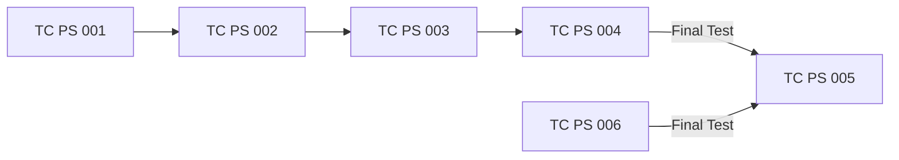

[[_TOC_]]

Please execute the sequence test as outlined below:

```mermaid
graph LR
    A[TC PS 001] --> B[TC PS 002]
    B --> C[TC PS 003]
    C --> D[TC PS 004]
    D --> |Final Test| E[TC PS 005]
     
    F[TC PS 006] --> |Final Test| E

    click A "https://dev.azure.com/Daifuku-SW/ID_SimeDarbyPlantation/_wiki/wikis/ID_SimeDarbyPlantation.wiki/1167/TC-PS-001-Empty-Pallet-Supply-via-Standard-Retrieval-Cycle-(ST1210-Triggered)"
    click B "https://dev.azure.com/Daifuku-SW/ID_SimeDarbyPlantation/_wiki/wikis/ID_SimeDarbyPlantation.wiki/1189/TC-PS-002-Palletizing-Start-Screen"
    click C "https://dev.azure.com/Daifuku-SW/ID_SimeDarbyPlantation/_wiki/wikis/ID_SimeDarbyPlantation.wiki/1158/TC-PS-003-No-Operations-(Empty-Pallet-Supply)-1210-to-110x-Barcode-No-Read-Rejection"
    click D "https://dev.azure.com/Daifuku-SW/ID_SimeDarbyPlantation/_wiki/wikis/ID_SimeDarbyPlantation.wiki/1160/TC-PS-004-Batch-Start"
    click E "https://dev.azure.com/Daifuku-SW/ID_SimeDarbyPlantation/_wiki/wikis/ID_SimeDarbyPlantation.wiki/1191/TC-PS-005-Robot-Station-111x-to-ASRS-Rack-and-Host-Reporting-Flow"
    click F "https://dev.azure.com/Daifuku-SW/ID_SimeDarbyPlantation/_wiki/wikis/ID_SimeDarbyPlantation.wiki/1155/TC-PS-006-Batch-End-Force-Completion-Handling-Exception-Recovery"
```

[[_TOSP_]]

   